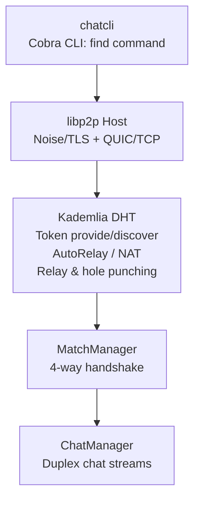

# 🌐 p2p-chat --- Decentralized 1-on-1 Matchmaking CLI

A minimal, serverless, peer-to-peer chat client built with **Go** and
**libp2p**. Powered by **Kademlia DHT**, **AutoRelay**, and a custom
**handshake protocol** for secure 1-on-1 chat sessions.

## ✨ Features

-   🔍 **Decentralized discovery**: Find peers via Kademlia DHT, no
    central server required.
-   🎲 **Two modes of pairing**:
    -   Public lobby (`chat-public-111`) for random stranger chats.
    -   Token-based lobbies for private sessions.
-   🤝 **Deterministic 4-way handshake**: Ensures fair 1-on-1 matching.
-   🔒 **Transport encryption**: Secured with libp2p Noise/TLS.
-   🌍 **NAT traversal**: Supports AutoRelay and PortMapping.
-   ⚡ **Real-time duplex chat**: Goroutines enable simultaneous
    send/receive.
-   🛠️ **CLI-first**: Built with Cobra for simple commands and easy
    testing.

## 🚀 Quickstart

### Build

``` bash
go build -o p2pchat .
```

### Run

**Terminal 1 (advertise in token):**

``` bash
./p2pchat find --name=alice --token=movie-night
```

**Terminal 2 (search & match):**

``` bash
./p2pchat find --name=bob --token=movie-night
```

- Use `--token` to join a custom lobby.
- If no token is provided, defaults to `chat-public` (random chat).

## 🏗️ Architecture



## 🔑 Handshake Protocol

1.  Peer A sends `MATCH`.
2.  Peer B replies `ACCEPT`.
3.  Peer A confirms with `ACCEPTED`.
4.  Peer B finalizes with `ACCEPTED`.

Both peers lock in and start chat on a unique protocol ID
(`/chat/<token>/<idA>-<idB>`). This ensures: - Only two peers per token
at a time. - No "third wheel" interference.

## 📦 Commands & Flags

``` bash
p2pchat find [--name <username>] [--token <lobby>]
```

-   `--name`: Display name in chat.
-   `--token`: Private lobby ID (default: `chat-public`).

## 🔐 Security Notes

-   Transport encrypted with libp2p (Noise/TLS).
-   Each chat uses a unique protocol ID.
-   Future roadmap: End-to-End Encryption (NaCl), session keys, forward
    secrecy.

## ⚠️ Disclaimer

This project explores decentralized networking and private messaging.
Use responsibly. Not intended for unlawful purposes.

## 📌 Roadmap

-   End-to-End Encryption with NaCl.
-   Optional relay deployment (self-hosted).
-   File transfer over streams.
-   UX improvements (presence, reconnects, logs).

## 📝 License

GNU --- do whatever you want, just be responsible.

Built with ❤️ in Go + libp2p.
